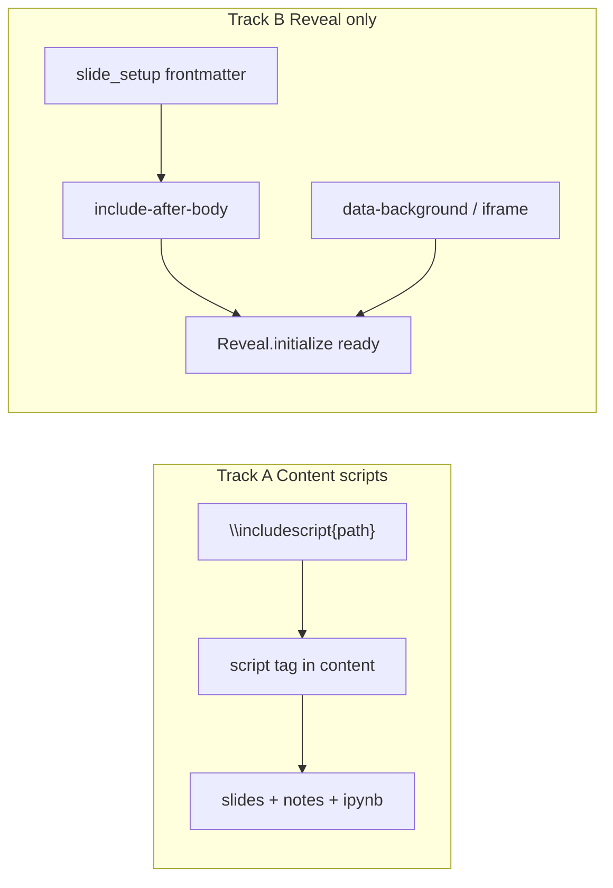

# CIP-0012: Content scripts vs Reveal slide setup and backgrounds

> **Note**: CIPs describe HOW to achieve requirements (WHAT).
> Use `related_requirements` to link to the requirements this CIP implements.

## Status

- [x] Proposed - Initial idea documented
- [ ] Accepted - Approved, ready to start work
- [ ] In Progress - Actively being implemented
- [ ] Implemented - Work complete, awaiting verification
- [ ] Closed - Verified and complete
- [ ] Rejected - Will not be implemented (add reason, use superseded_by if replaced)
- [ ] Deferred - Postponed (use blocked_by field to indicate blocker)

## Summary

Clarify and implement **two distinct JavaScript authoring concerns** that today share ad-hoc patterns:

| Track | Role | Formats |
|-------|------|---------|
| **A — Content scripts** | Interactive widgets *in* figures / body (ballworld, dasher, …) | All HTML outputs (slides, notes/posts, notebooks) |
| **B — Reveal setup & backgrounds** | Deck chrome and full-bleed slide backgrounds | Reveal HTML slides only |

One CIP covers both because they share `scriptsDir`, documentation, and testing conventions — but the **authoring surfaces and format expansion rules must stay separate**. Do not merge them into a single “slides JS” macro.

**Stage 0 (required before API changes):** inventory snippets and talks for existing JS use, classify Track A/B/other, and build a **fixture-based regression suite** from that inventory (`cip/cip0012/inventory.md` + `tests/fixtures/cip0012/`).

**Out of scope:** Manim SVG background playback ([CIP-000D](cip000D.md)); frame-slider figure animations ([CIP-0007](cip0007.md) / `figure-animate.js`); registering arbitrary Reveal plugins via frontmatter (defer if needed).

### Why not separate CIPs?

Separate CIPs would split a small, tightly related design across two documents without independent delivery value. Track A is mostly formalising an existing snippet pattern; Track B is the new build hook (`slide_setup` / include-after). Keeping both in CIP-0012 with explicit tracks is enough. Split later only if Track A grows into a larger multi-format widget framework.

## Motivation

Authors already:

- Embed **content** demos via snippet includes that emit `<script src="\scriptsDir/...">` into slides *and* posts/notebooks.
- Set **static** slide backgrounds with `\newslide{...}{data-background="..."}`.
- Load **deck-wide** JS via `slidesheader` → pandoc `--include-in-header` (MathJax, `figure-animate.js`).

Problems:

1. **No named distinction** between “JS that is part of the content” and “JS that is Reveal chrome / background.” Authors (and macros) can put the wrong thing in the wrong place.
2. **Reveal lifecycle gap.** Body/header scripts run before `Reveal` exists. The template’s `$include-after$` sits after `Reveal.initialize`, but `make-slides.mk` never passes `--include-after-body`.
3. **Background authoring is informal.** `\includeplotly` uses `data-background-iframe`; ambient deck animation has no supported hook. Frontmatter `background:` is a *layout numbering* field, not a visual background — easy to confuse.
4. **Shared header pollution.** Talk-specific Reveal setup in default `slides-header.html` affects every deck.

## Detailed Description

### Two tracks (do not conflate)



| Question | Track A | Track B |
|----------|---------|---------|
| Is this part of a figure / explanation? | Yes | No — chrome or full-bleed backdrop |
| Should notes/posts/ipynb get it? | Yes (HTML) | No |
| Needs `Reveal` API? | Usually no | Yes for setup; backgrounds use reveal section attrs |
| Primary authoring | `\includescript` / snippet includes | `slide_setup`, `\newslide{…}{data-background…}` |

**Decision rule for authors:** if removing Reveal would still leave a meaningful interactive figure, it is Track A. If the effect is “behind the deck” or “this slide’s backdrop,” it is Track B.

### Current architecture (baseline)

```
.md + snippets
  → mdpp (-DscriptsDir=…) → format-specific markdown
  → pandoc (revealjs | html | …)
```

| Layer | Today | Gap |
|-------|-------|-----|
| Content scripts | Raw `<script>` in `_scripts/includes/*.md` | No first-class `\includescript`; duplication |
| Deck header | `slidesheader` → `--include-in-header` | Runs before Reveal; wrong place for deck setup |
| Post-init | Template `$include-after$` | **Not wired** by make |
| Per-slide BG | `\newslide` attrs; `\includeplotly` | Undocumented; no ambient deck pattern |

Reveal CDN path remains **3.9.2-style**. CIP-000D’s Manim SVG path (Reveal 5) stays separate.

---

### Track A — Content scripts (multi-format HTML)

**Goal:** First-class, once-guarded script loads for interactive content that travels with HTML wherever that content is rendered.

- Macro: `\includescript{relpath}`
- Expand in **all HTML-emitting macro sets** that include interactive content (at least slides-html, notes-html, and the HTML portions used by ipynb pipelines — exact file list fixed at implementation).
- **No-op** in TeX / PDF / PPTX / docx / Manim macro files (no script tags in those outputs).
- Emits:

```gpp
\define{\includescript{relpath}}{\ifndef{scriptIncluded_\sanitised}
\define{scriptIncluded_\sanitised}
<script src="\scriptsDir/\relpath"></script>
\endif}
```

(Guard name must sanitise `/` and other characters for GPP.)

- Lifecycle: DOM parse / `DOMContentLoaded` is enough; do **not** require Reveal.
- Migration: existing ballworld/dasher includes remain valid; docs show equivalence to `\includescript{ballworld/ballworld.js}`.
- Snippet convention: `_scripts/includes/` may wrap `\includescript` for multi-file demos (ballworld + maxwell).

Track A does **not** use `slide_setup` or `data-background-iframe`.

---

### Track B — Reveal setup and backgrounds (slides only)

**Goal:** Explicit hooks for presentation chrome and full-bleed slide backgrounds that must not leak into notes or notebooks.

#### B1. Frontmatter `slide_setup` → `--include-after-body`

```yaml
slide_setup: my-deck-setup.html   # under includes/, resolved like slidesheader
```

- `make-slides.mk` passes `--include-after-body=…` **only when set**.
- Fragment runs after `Reveal.initialize` — safe for:

```html
<script>
  Reveal.addEventListener('ready', function () { /* mount ambient canvas */ });
  Reveal.addEventListener('slidechanged', function (e) { /* pause/resume */ });
</script>
```

**Deck-wide ambient animation:** fixed canvas/div behind `.reveal .slides`; start on `ready`; respect `print-pdf` / visibility.

#### B2. Per-slide backgrounds

| Goal | Authoring |
|------|-----------|
| Static image | `\newslide{Title}{data-background="\writeDiagramsDir/pres_bg.png"}` |
| Interactive / animated full-bleed page | `\newslide{Title}{data-background-iframe="\scriptsDir/my-bg/index.html" data-background-interactive}` |
| Plotly as background | existing `\includeplotly{…}` |

Optional Reveal-only helpers (only if they nest cleanly inside `\newslide`’s second argument):

```gpp
\define{\slidebackground{url}}{data-background="\url"}
\define{\slidebackgroundiframe{url}}{data-background-iframe="\url" data-background-interactive}
```

Otherwise document raw attributes as the primary API.

**Pitfall:** frontmatter `background:` numbers `layout: background` files — it is **not** a slide background.

Track B macros and `slide_setup` must **never** emit into notes-html / ipynb / tex / pptx.

---

### Mermaid / template hygiene (when touching the template)

Move Mermaid’s `Reveal.addEventListener('ready', …)` out of `<head>` (before Reveal loads) into the post-`Reveal.initialize` region, sharing the Track B lifecycle with `slide_setup`.

### Alternatives considered

| Alternative | Why not |
|-------------|---------|
| One “slides-only” `\includescript` for everything | Breaks ballworld-style multi-format content; conflates tracks |
| Separate CIP per track | Unnecessary for this scope; see Summary |
| Only document existing escapes | Lifecycle and naming gaps remain |
| `reveal_plugins:` frontmatter | Larger 3.x/5.x design; defer |
| Fold ambient backgrounds into CIP-000D | Wrong pipeline |

### Tenets

- **Explicit over implicit:** Track A vs B is a named decision; setup path is frontmatter, not a shared header edit.
- **Compose, don’t monolith:** content load ≠ deck setup ≠ per-slide background.
- **Single source, multiple contexts:** Track A content scripts follow the content across HTML formats; Track B stays Reveal-only so other formats stay clean.
- **Configuration lives with content:** `slide_setup` travels with the talk / topic `_lamd.yml`.

## Implementation Plan

### Stage 0 — Inventory existing JavaScript use (before API changes)

Review real authoring in **snippets** and **talks** (and lamd’s own includes/headers). Record findings under `cip/cip0012/` (e.g. `inventory.md`); keep the CIP itself as the decision document.

1. **Search corpus** (at least):
   - `snippets/**/*.md` — `<script`, `scriptsDir`, `_scripts/includes`, canvas widgets
   - `talks/**/*.md` — same, plus `data-background`, `data-background-iframe`, `slidesheader`, custom headers
   - `lamd/includes/`, `lamd/macros/` — shared header JS, `\includeplotly`, animation init scripts
2. **Classify each hit** as Track A (content / multi-format), Track B (Reveal setup / background), or other (e.g. CIP-0007 frame controls, MathJax, Mermaid).
3. **Note format reach** — which outputs currently receive each script (slides only vs posts/notes/ipynb).
4. **Produce a fixture list** — a small set of representative includes/talks that the regression suite must cover (ballworld/maxwell, dasher or dieroll, privacy `data-background`, header `figure-animate`, any iframe-background if present).

No macro or makefile changes land until Stage 0 is reviewed and the fixture list agreed.

### Stages 1+ — Implement against the inventory

1. **Document the Track A / Track B split** in this CIP (done); mirror in `docs/contexts/slides.md` at compression, using inventory examples.
2. **Test suite from inventory** (see Testing Strategy) — land fixtures and failing-or-baseline tests *before* or *alongside* behaviour changes so migrations are measurable.
3. **Track B — wire `slide_setup`**
   - Extract field with `slidesheader` in make/mdfield batch.
   - Conditionally pass `--include-after-body` from `make-slides.mk`.
4. **Track A — `\includescript{relpath}`**
   - Define in all relevant HTML macro files; no-op elsewhere.
   - Once-guards; unit tests include inventory-derived cases.
5. **Track B — background helpers** (optional) + document raw attrs and `background:` pitfall.
6. **Template hygiene** — include-after placement; Mermaid lifecycle fix.
7. **Migration / examples**
   - Track A: migrate or twin at least one inventoried loader to `\includescript`.
   - Track B: minimal `slide_setup` ambient snippet + one iframe-background slide example.
8. **Compress docs** after close (`compressed: true`).

## Backward Compatibility

- Additive. Existing raw `<script>` snippets and `slidesheader` keep working.
- No change to CIP-0007 / CIP-000D pipelines.
- Decks without `slide_setup` omit `--include-after-body` entirely.
- Inventory-based regression tests must keep passing for **unmigrated** legacy includes until an explicit migration task retires them.

## Testing Strategy

### Inventory-driven suite

Tests are derived from Stage 0, not invented in isolation.

| Layer | What | Source |
|-------|------|--------|
| **Corpus / inventory check** | Optional CI or unit helper: known patterns still detectable; inventory fixture list stays in sync with listed paths | `cip/cip0012/inventory.md` + path list in tests |
| **Macro expansion (Track A)** | For each inventoried content-script pattern (or a reduced fixture copy under `tests/`), expand via slides-html **and** notes-html: `<script src="…scriptsDir…">` present; tex/pptx: absent; once-guard: no duplicate tags | e.g. ballworld / maxwell-style loaders |
| **Attribute / background (Track B)** | Inventoried `data-background` (and iframe if any) still emit on reveal sections after `\newslide` | privacy-style fixtures |
| **Header / shared JS** | Default `slides-header` still references MathJax + `figure-animate.js`; animation init scripts from CIP-0007 remain intact | lamd includes |
| **Build (Track B new)** | Fixture talk with `slide_setup` places fragment after `Reveal.initialize`; without it, no empty `--include-after-body` | new fixtures |
| **Migration golden** | After `\includescript` exists: twin fixture — legacy include vs `\includescript` — same script `src` set in HTML outputs | inventory representatives |

Prefer **checked-in minimal fixtures** under `tests/` (or `tests/fixtures/cip0012/`) that copy or slim real snippet patterns, rather than depending on live `talks/` / `snippets/` checkouts in CI. The inventory document maps each fixture back to the real talk/snippet path for human review.

### Manual / browser (Track B)

- `ready` / `slidechanged` ambient setup; iframe background slide; print-pdf behaviour documented.
- Spot-check one inventoried live talk (e.g. Information Engines) after migration.

## Related Requirements

No dedicated requirement yet. If Accepted, prefer **one** WHAT that states both capabilities with the format split made explicit, e.g. “Authors can load content JavaScript across HTML outputs and attach Reveal-only setup/backgrounds without editing shared headers,” then set `related_requirements`.

Related CIPs:

- [CIP-0007](cip0007.md) — in-slide frame animations (content-adjacent controls, not Track B chrome).
- [CIP-000C](cip000C.md) / [CIP-000D](cip000D.md) — Manim / SVG background layer on a separate HTML path.

## Implementation Status

- [ ] **Stage 0:** Inventory snippets + talks (+ lamd includes) for JS use; classify A/B/other; write `cip/cip0012/inventory.md` and fixture list
- [ ] **Stage 0 review:** Agree fixture list before API/makefile changes
- [ ] Land inventory-derived test fixtures + baseline/regression suite under `tests/`
- [ ] Keep Track A / Track B distinction in design and docs
- [ ] Wire `slide_setup` → `--include-after-body` (Track B)
- [ ] Add `\includescript{relpath}` for multi-format HTML (Track A) + inventory-based unit tests
- [ ] Add or defer `\slidebackground` / `\slidebackgroundiframe` (Track B)
- [ ] Template: verify include-after; fix Mermaid Reveal lifecycle
- [ ] Examples / migration: at least one inventoried content loader + Reveal `slide_setup` / iframe background
- [ ] Compress into `docs/contexts/slides.md` after close (`compressed: true`)

## References

- [`lamd/makefiles/make-slides.mk`](../lamd/makefiles/make-slides.mk) — `--include-in-header` only today
- [`lamd/templates/pandoc/pandoc-revealjs-template.revealjs`](../lamd/templates/pandoc/pandoc-revealjs-template.revealjs) — `$include-after$` after `Reveal.initialize`
- [`lamd/includes/slides-header.html`](../lamd/includes/slides-header.html) — MathJax + figure-animate
- [`lamd/macros/talk-macros-slides.gpp`](../lamd/macros/talk-macros-slides.gpp) — `\newslide{text}{commands}`
- [`lamd/macros/talk-macros-slides-html.gpp`](../lamd/macros/talk-macros-slides-html.gpp) — `\includeplotly` iframe background
- [`docs/contexts/slides.md`](../docs/contexts/slides.md) — slides context docs
- Snippets: `_scripts/includes/ballworld-js.md` and related loaders (Track A precedent)
- Talks: static `data-background` in privacy snippets (Track B); Information Engines canvases (Track A)
- Stage 0 output (when present): [`cip/cip0012/inventory.md`](cip0012/inventory.md)
